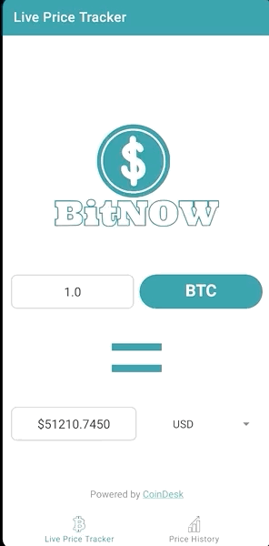

<h1>
  <strong>BitNow </strong>   

</h1>

<h1 id="tableOfContents"><strong>Table of Contents</strong></h1>
<ul>
  <li>
    <h3>
      <a href="#projectDescription">Project Description</a>
    </h3>
  </li>
  <li>
    <h3>
      <a href="#screenshots">Screenshots</a>
    </h3>
  </li>
    <li>
    <h3>
      <a href="#installationInstructions">Installation Instructions</a>
    </h3>
  </li>
  <li>
    <h3>
      <a href="#operatingInstructions">Operating Instructions</a>
    </h3>
  </li>
  <li>
    <h3>
      <a href="#howToContribute">How To Contribute</a>
    </h3>
  </li>
  <li> 
    <h3>
      <a href="#projectManifest">Project Manifest</a>
    </h3>
  </li>
  <li>
    <h3>
      <a href="#copyright">Copyright</a>
    </h3>
  </li>
  <li>
    <h3>
      <a href="#bugList">Bug List</a>
    </h3>
  </li>
   <li>
    <h3>
      <a href="#futureImplementations">Future Implementations</a>
    </h3>
  </li>
  <li>
    <h3>
      <a href="#creditsAndAcknowledgements">Credits and Acknowledgements</a>
    </h3>
  </li>
</ul>

<h1 id="projectDescription"><strong>Project Description</strong></h1>
This project is an android application written in Kotlin using fragments and the MVC (Model View Controller) Software Design Pattern. The project is a bitcoin live price tracker, which uses the coindesk API (referenced in credits and acknowledgements)
to fetch the currrent price of bitcoin. The live price tracker supports currency conversion in CAD, USD, and EUR. The app also allows the user to input custom quantities of both bitcoin and fiat money, to which the app will convert the non-inputted value correctly.
The app also contains a pricehistory feature which will show a line chart of the price of bitcoin over a specified date range*. 
  
* - this feature has not yet been implemented and will be included in a later release. As of right now, the price history date range is hard-coded into the application.

<h1 id="screenshots"><strong>Screenshots</strong></h1>
  

</img>
<h4 align="center"><i> The app on startup. </i></h4>

</img>
<h4 align="center"><i> The app showing different currency selection and bitcoin quantity input. </i></h4>

</img>
<h4 align="center"><i> Showcasing the currency dropdown. </i></h4>

</img>
<h4 align="center"><i> Custom FIAT money input </i></h4>

</img>
<h4 align="center"><i> Price History Screen </i></h4>

<h4 align="center"><i> The Price History Chart Animation </i></h4>

<h1 id="installationInstructions"><strong>Installation Instructions</strong></h1>

To install and run this application, please download the latest version of android studio from <a href="https://developer.android.com/studio?gclid=Cj0KCQjwvYSEBhDjARIsAJMn0lhkNbnDpB5MvezVw4KTxTkCUznJZrJ45bIBcEH2Rn71yGt-a_sbcJYaAoLkEALw_wcB&gclsrc=aw.ds">Here</a>  
The project was created with a minimum SDK of 19 and a target SDK of 30. This repository can then be cloned or downloaded and imported into android studio. Please ensure that your SDK version is correct.

<h1 id="operatingInstructions"><strong>Operating Instructions</strong></h1>

This app can be run using android version 4.0 or greater. It can be run using the built-in emulator within android studio OR by using an actual android device.

<h1 id="howToContribute"><strong>How To Contribute</strong></h1>

Any and all contributors are welcomed to this project. 
To Contribute,
<ul>
  <li>Clone the repo and create a new branch</li>
  <li>Make changes, add features, and test.</li>
  <li>Create a pull request. Ensure to include a consise description of the changes you made.</li>
</ul>

<h1 id="projectManifest"><strong>Project Manifest</strong></h1>
<h4>The main files are contained within app/src/main</h4>
 
<h5> From there, /res/ contains all layout (xml) files</h5>
 
<h5>Or, /java/com/example/bitnow/ contains all kotlin files</h5>
<ul>
  <li> /data/: contains all files used to communicate with the CoinDeskApi. </li>
  <li> /ui/: contains all fragments and viewmodels </li>
  <li> MainActivity.kt contains the main activity to connect to the fragments and nav bar. </li>

</ul>  

<h1 id="copyright"><strong>Copyright</strong></h1>

All data used in this app is retrieved from the<a href="https://www.coindesk.com/coindesk-api">Coindesk API</a>

<h1 id="bugList"><strong>Bug List</strong></h1>

<ul>
  
  <li>~~The Chart does not update once the asynchronous API call is complete~~</li>
  <li>invalid character (non-digit) at the end of the fiat_price_edittext causes the app to crash</li>
  <li>user-inputted values on livepricefragment resets upon switching to the price history fragment</li>
  
</ul>
  
  
<h1 id="futureImplementations"><strong>Future Implementations</strong></h1>

<ul>
  <li>PriceHistory
    <ul>
      <li>Add Currency Conversion</li>
      <li>Add User-Specified Date Ranges</li>
    </ul>
  </li>
  <li>LivePrice
    <ul>
      <li>Add feature which refreshes the API on a 30-second basis </li>
    </ul>
  </li>
  <li>Additional Features
    <ul>
      <li>Implement a third fragment which fetches tweets from Elon Musk that mention bitcoin using the twitter API and regex. This feature will notify the user whenever elon makes a tweet about bitcoin</li>
      <li>Notify the user whenever bitcoin hits a new all-time high, all-time low, 60-day high, etc.</li>
    </ul>
  </li>
</ul>  
  

<h1 id="creditsAndAcknowledgements"><strong>Credits and Acknowledgements</strong></h1>

<ul>
  <li> <a href="https://github.com/AAChartModel/AAChartCore-Kotlin">AACharts</a> Used to create the price history chart </li>
  <li> <a href="https://github.com/square/moshi">Moshi</a> and <a href="https://square.github.io/retrofit/">Retrofit2</a> used to make API requests, handle responses, and parse JSON</li>
  <li> <a href="https://www.coindesk.com/coindesk-api">CoinDesk</a> Used to retrieve real-time bitcoin price updates and price history updates</li>
  <li> <a href="https://github.com/Bearded-Hen/Android-Bootstrap#:~:text=Android%20Bootstrap%20is%20an%20Android,familiar%20with%20the%20Bootstrap%20Framework.">Bootstrap</a> used to help create UI </li>
  <li> <a href="https://www.canva.com/">Canva</a> used to create some images and logos </li>
  <li> <a href="https://github.com/Ileriayo/markdown-badges#how-to-use">Markdown Badges</a></li>

</ul>

